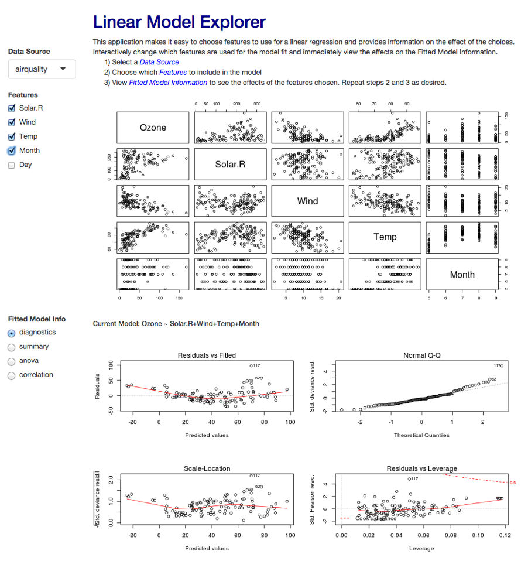
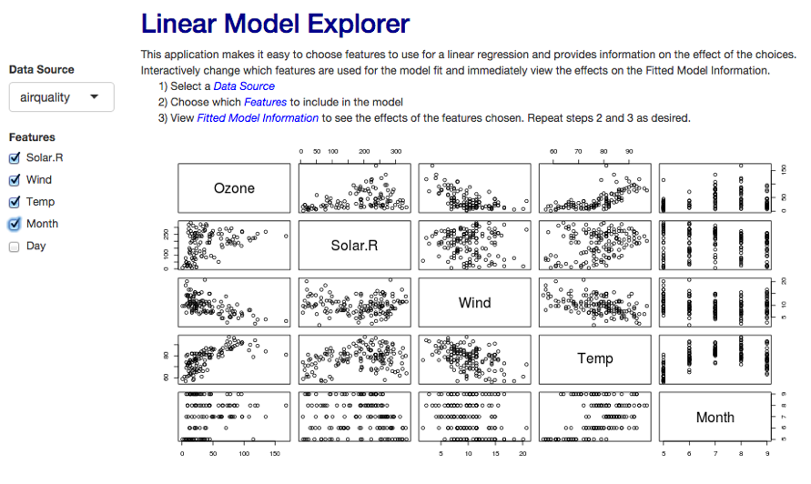
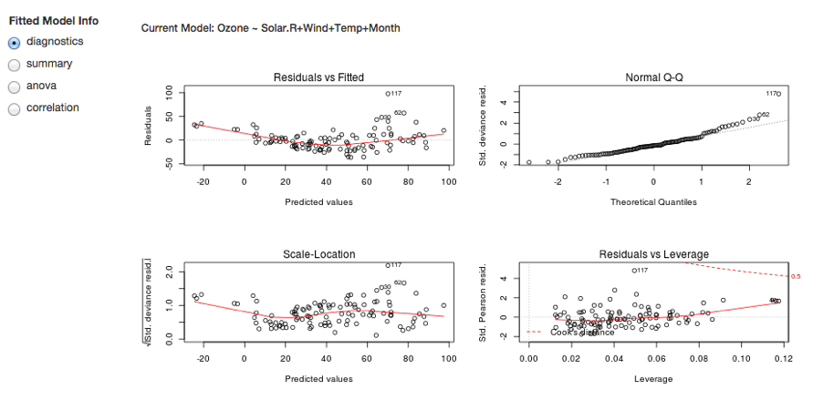

## Linear Model Explorer Application

<div style="display: block;float: right;width: 50%;padding-right:20px;">

</div>

<div style='padding-top: 20px; width: 43%;'>
<ul>
  <li style='font-size: 80%;'>Simple dashboard to explore linear regression.</li>
  <li>Selectable datasets for exploration</li>
  <li>Responsive feedback to changes in selected dataset features.</li>
  <li>Responsive updates to model information.</li>
    <ul>
      <li style='font-size: 60%;'>Four diagnostic plots for model fit</li>
      <li style='font-size: 60%;'>Summary information about the model</li>
      <li style='font-size: 60%;'>Analysis of variance (anova) for the model</li>
      <li style='font-size: 60%;'>Correlation information for selected features</li>
    </ul>
</ul>
<p style='font-size: 70%;'><a href="https://kdobrien84.shinyapps.io/shinyfirstproject">
      https://kdobrien84.shinyapps.io/shinyfirstproject</a>
</div>

---

## Model Feature Selection

<div style="display: block;padding-left:10%;">

</div>

* Data Source.  Choose from 5 data sets from the R Datasets package
  + mtcars, airquality, swiss, attitude and USJudgeRatings
* Features.  Enable/disable a feature.
  + pairs plot and model information updates immediately

---

<style>
em {
  font-style: italic
}
</style>
## Fitted Model Information

<div style="display: block;padding-left:10%;">

</div>

* The information updates whenever the dataset or features change
  + diagnostics - performs *plot(model)* for fitted model using selected features
  + summary - captures R output (capture.output) of the *summary(model)* command
  + anova - captures the R output of the *anova(model)* command
  + correlation - shows the output of *cor* for only selected features
  

---

## Diagnostic Plot Example


```{r out.width = '600px', out.height = '350px'}
library(datasets)
model <- lm(Ozone ~ Solar.R+Wind+Temp+Month, data=airquality)
par(mfrow=c(2,2))
plot(model)
```


